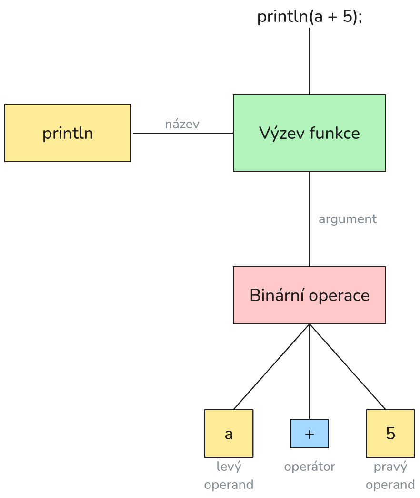

\newpage

# Pro učitelé

Projekt mám celkem dokončený, proto považoval bych to za final draft. Samozřejmě, počítám s
možnými výtkami a návrhy pro vylepšení.

Kapitola [Sestavení] popisuje jak zkompilovat projekt.

Část \nameref{part:implementation} popisuje implementaci, a také strukturu projektu.

Dokument byl napsán v Markdownu, a převeden do PDF pomocí nástroje [Pandoc](https://pandoc.org/).

## Původní zadání

- Aritmetické operátory (`+, -, *, /, %`)

- Inkrementace/dekrementace (`++, --`)

- Logické operátory (`&&, ||, ==, !=, >, <, >=, <=, !`)

- Spojování řetězců (`"hello" + " " + "world"`)

- Závorky (`2 * (2 + 3) / (3 - 4)`)

- Speciální operátor `#`, který vrátí počet prvku v poli nebo délku řetězce

- Speciální operátor `$`, který konvertuje celé číslo v řetězec.
Použití u jiného typu vyvolá chybu při parsingu.

- Speciální operátor `*`, který vytěží uloženou hodnotu ve volitelném typu (viz dále).
Pokud tento typ neobsahuje hodnotu, program ukončí se s chybou.
Použití u void vyvolá chybu při parsingu.

- Operátor `[index]`, který se používá k indexování prvku v polích nebo znaků v řetězcích.
Záporná hodnota nebo mimo hranice ukončí program s chybou.

- Datové typy: `int, void, string, pole (`[type, n]`, kde type je uchovávaný typ, `n` je počet
prvku). Pokud typ obsahuje na konci znak `?`, jedná se o volitelný typ.
Objekt takového typu buď obsahuje hodnotu specifikovaného typu, nebo neobsahuje
(přesněji řečeno obsahuje speciální hodnotu `nil`).

- Cykly `while` a `for`

- Podmínky `if`, `else if`, `else`

- Funkce s 0 nebo více parametry a návratovou hodnotou
(`return_type name()` nebo `return_type name(param1, param2, ...);`)

- Komentáře začínají `//`

- Zabudovaná funkce `print`, která přijímá řetězec a vypíše ho. (`void print(string s);`)

- Zabudovaná funkce `println`, která přijímá řetězec a vypíše ho spolu s newline znakem.
(`void println(string s);`)

- Zabudovaná funkce `input_int`, která načte celé číslo a vrátí ho (`int? input_int();`)

- Zabudovaná funkce `input_string`, která načte řetězec a vrátí ho (`string input_string();`).

### Změny

- Rozhodl jsem implementovat dynamické pole (přesněji seznamy) místo statických polí. Při deklaraci
není nutno uvádět rozměr. Pokud je uveden, prvky budou vynulovány.

- Nový operátor `+=`: přidá prvek na konec seznamu.

- Nový operátor `-=`: odstraní zadaný počet prvku z konce seznamu

- Nový operátor `#=`: nastaví rozmer seznamu na zadaný

- Nová zabudovaná funkce `void exit(int code)`, která ukončí program uprostřed vykonávání.

- Nová zabudovaná funkce `int random()`, která vratí náhodné číslo.

- Nová zabudovaná funkce `int random_range(int min, int max)`, která vratí náhodné číslo v zadaném
intervalu.

- Nová zabudovaná funkce `string chr(int ch)` pro převod číselné hodnoty do ASCII znaku.

- Nová zabudovaná funkce `int ord(string ch)` pro převod ASCII znaku do číselné hodnoty.

- Zabudovaná funkce `input_string` teď ma navratový typ `string?`. Vrací `nil` v případě chyby ve
čtení vstupu.

- Tyto změny vznikly spontánně.

## Použité knihovny třetích stran

- [isocline](https://github.com/daanx/isocline) - přenosná alternativa GNU Readline, která
rozšiřuje možnosti editace v příkazovém řádku. Použito pro REPL.

- [greatest](https://github.com/silentbicycle/greatest/tree/release) - jednoduchá knihovna pro
(unit) testování. Použito pro programy ve složce `tests`.

## Stručný popis programu

Běh programu probíha následovně:

1. Načtení zdrojového kodu (ze souboru nebo klavesnice)
2. Lexikální analýza *(lexing)*
3. Syntaktická analýza *(parsing)*
4. Semantická analýza a vygenerování syntaxového stromu (AST) *(semantic analysis)*
5. Interpretace prochazením AST *(tree-walk interpretation)*

Program podporuje REPL a vykonávaní ze specifikováného souboru.

```
1.  monolog FILENAME
2.  monolog scan FILENAME
3.  monolog parse FILENAME
4.  monolog repl
```

1. Spustí soubor s názvem `FILENAME`. V příkazovém řádku vratí 0 v případě uspěchu, poslední hodnotu
předanou zabudované funkcí `void exit(int exit_code)`, nebo -1 v případě chyby za běhu.

2. Načté soubor `FILENAME` a vypíše posloupnost tokenů.

3. Načté soubor `FILENAME` a vypíše jeho syntaktický strom.

4. Spustí v režímu REPL. V tomto režímu uživatel interaktivně zadává příkazy, program pak každý
zpracovává a vykonává. Veškere proměnné a funkce jsou pamatováný a použitelný mezi přikazama.

Také v režímu REPL interpretátor hned se neukončí v připadě chyby.

# Sestavení

Monolog používá CMake pro kompilaci. K dispozici je na [jejích webu](https://cmake.org/), nebo,
pokud použiváte Linux, v repozitáři vašé distribuce.

Pokud nehodlate kompilovat pomoci CMake nebo vyskytla se chyba, v hlavní složce najdete skript
`build.bat` pro Windows, a `build.sh` pro Linux, které ručně vyvolávájí kompilátor.

## Předpoklady

### Kompilátor

K sestavení je zapotřebí kompilátor, který podporuje C11. GCC podporuje tuto normu již od 5 verze
(aktuální verze je 15 nebo větší). Clang podporuje tuto normu od 3.3 verze, vydané v roce 2013.

MSVC jsem netestoval.

#### GCC

Pro Microsoft Windows kompilátor GCC jde ziskat přes MinGW (implementace GCC a dálších programů GNU
pro Windows), MSYS2 nebo Cygwin.

Já osobně doporučuju [w64devkit](https://github.com/skeeto/w64devkit). w64devkit je portabilní
balíček, založený na MinGW-64. Zahrňuje kompilátor GCC, ladič GDB, editor Vim atd.

V případě Linuxu, kompilátor GCC by měl být již nainstalovaný, ale měl by být také v repozitáři
vašé distribuce.

#### Clang

Clang lze získat z [oficiálního webu LLVM](https://llvm.org/).

Pokud použiváte Linux, měl by být v repozitáři vašé distribuce.

### Systém sestavení (pro CMake)

CMake nekompiluje nic sám, ale generuje skript pro konkretní systém sestavení, proto musíte mít
nějaký nainstalovaný.

Pokud použiváte MinGW nebo MSYS, měli by mít zahrnutou implementaci GNU Make. Jinak doporučuju
[Ninja](https://ninja-build.org/).

**DŮLEŽITÝ PRO WINDOWS**: ujistěté se, že všechny tyto programy jsou dostupné přes proměnnu
prostředí PATH!

## Sestavení pomocí CMake

1. Otevřte terminál/konzoli ve složce Monologu, a vytvořte složku pro kompilaci:

```sh
mkdir build
```

2. Pak do ní přejděte:

```sh
cd build
```

3. Pro generaci:

```sh
cmake -DCMAKE_BUILD_TYPE=Release -G "VÁŠ GENERÁTOR" ..
```

Jestli použiváte MinGW, napíšte jako generátor "Unix Makefiles".

- Pokud chcete použit jiný kompilátor, přidejte `-DCMAKE_C_COMPILER=cesta_ke_kompilatoru"`.

- Pokud chcete zkompilovat i testovací programy, přidejte `-DBUILD_TESTS=ON`.

Zvolení generátoru:

- Pro MinGW - "MinGW Makefiles".
- Pro MSYS - "MSYS Makefiles".
- Pro Linux - "Unix Makefiles".
- Pokud chcete použit Ninja, napíšte "Ninja".
- Jinak můžete zkusit vynechat parametr `-G`, a CMake zvolí si sám.

4. Zadejte `cmake --build .` aby zkompilovat, případně vyvolejte přímo sestavovácí systém.

5. Pokud kompilace proběhla úspěšně, ve složce `src` (uvnitř složky `build`) měl by být soubor
`monolog.exe` (na Linuxu bez připony).

\newpage
\part{Příručka}

# Úvod

Monolog je jednoduchý, interpretovaný jazyk, podobný C svou syntaxi a konstrukcemi.

```c
// Minimální hello world

println("Hello, World!");
```

Je to **statický typovaný** jazyk, což znamená, že všechny proměnné a funkce mají pevně přiřazený
typ, který se specifikuje explicitně při deklaraci/definici.

Jediný podporovaný paradigma je **imperativní programování** (procedurální) - vykonávání
posloupností příkazu, které mohou přímo měnit stav programu.

*Poznámka: pro popis gramatiky tento dokument používá [dialekt EBNF](https://www.w3.org/TR/xml/#sec-notation),
vyvinutý konsorciem W3C.*

# Výrazy a příkazy

```
expression      ::= literal | identifier | nil | binary | unary |
                    suffix | subscript | grouping | function-call
literal         ::= integer-literal | string-literal
integer-literal ::= [0-9]+
string-literal  ::= '"' char '"'
char            ::= /* jakýkoliv Unicode znak */

identifier ::= ([a-zA-Z] | '_') ([a-zA-Z] | '_' | [0-9])*
nil        ::= 'nil'

binary   ::= expression binary-op expression
             '-=' | '#=' | '<=' | '>=' | '==' | '!=' | '&&' | '||'
unary    ::= unary-op expression
suffix   ::= expression suffix-op
grouping ::= '(' expression ')'

statement-separated ::= (variable-declaration | return-statement |
                        break-statement | continue-statement | expression) ';'

statement ::= if-statement | while-statement | for-statement |
              statement-separated | function-declaration | block-statement
```

Monolog je stavěn na výrazech a příkazech:

- výraz je název pro kombinaci operátoru, konstant, proměnných a funkcí, a dá se vyčíslit jeho
hodnotu.

- příkaz vyjadřuje činnost, která ma být provedená. Může se skládat z výrazu.

Příkazy jsou oddělovány středníkem (`;`).

Oboje mohou způsobit tzv. **vedlejší účinky** - jev, když výraz/příkaz ovlivňuje i jinej stav
programu (např. hodnoty jiných proměnných) kromě své hodnoty.

Příkazy vykonávají se sekvenčně.

## Význam výrazu

Význam výrazu také může záviset na tom, kde a jak je použit. Například,

```c
int a = list[5];
```

výraz `list[5]` vratí hodnotu prvku s indexem 5 v seznamu `list`.

Ale příkaz

```c
list[5] = 115;
```

výraz `list[5]` v tomto případe nevrací hodnotu, ale je interpretován jako destinace, kam má byt
uloženo číslo 115.

To samé platí pro proměnné a indexování řetězcu (viz dále).

# Datové typy

```
type-specifier ::= int-type | string-type | void-type | option-type | list-type
int-type       ::= 'int'
string-type    ::= 'string'
void-type      ::= 'void'
option-type    ::= type-specifier '?'
list-type      ::= '[' type-specifier (',', expression)? ']'
```

Monolog nemá možnost definovat vlastní typy, ale obsahuje zabudované:

1. celé číslo `int` - 64-bitové číslo se znamínkem
2. řetězec `string` - měnitelná posloupnost znaků (bytů)
3. volitelný typ `T?`, kde `T` je libovolný typ
4. seznamy `[T]`, kde `T` je libovolný typ
5. prázdný typ `void`

Rekurzivita typu je podporovaná, takže deklarace jako `int???????`, `[[[int?]?]]?` nejsou zakázaný.

## Celá čísla

Primitivný typ `int` je určen pro prácí s celými čísly.

V Monologu, celá čísla jsou 64-bitová a mají znamínko.

## Řetězce

Složený typ `string` je posloupnost znaku (hodnoty typu `int`).

Každý řetězec ma jednu vlastnost - **délka** - počet znaků v řetězci

## Prázdný typ

Primitivný typ `void` je určen pro reprezentaci hodnot, které nemají hodnotu.

## Volitelný typ

Volitelný typ `T?` je **složený datový typ**, který:

1. buď obsahuje hodnotu typu `T`,
2. nebo obsahuje hodnotu speciálního typu `nil` *(prázdnost)*.

## Seznam

Seznam `[T]` je **složený datový typ**, který obsahuje prvky typu `T`, takže je zároveň **homogenní**.

# Operátory

```
binary-op ::= '+' | '-' | '*' | '/' | '%' | '<' | '>' | '+=' |
unary-op  ::= '-' | '+' | '*' | '!' | '#' | '$' | '++' | '--'
suffix-op ::= '++' | '--'
subscript ::= '[' expression ']'
```

V Monologu jsou binární (`a + 2`), unární (`-b`) a sufixové operátory (`a++` nebo `list[5]`).
Každý typ ma uřcitou sadu podporovaných operatorů.

## Aritmetické operátory

### Binární

| Levá strana | Pravá strana | Operátor | Operace                       | Vedlejší účinky | Výsledný typ |
|:-----------:|:------------:|:--------:|-------------------------------|:---------------:|:------------:|
| `int`       | `int`        | `+`      | provede sčítání               | NE              | `int`        |
| `int`       | `int`        | `-`      | provede odčítání              | NE              | `int`        |
| `int`       | `int`        | `*`      | provede násobení              | NE              | `int`        |
| `int`       | `int`        | `/`      | provede dělení                | NE              | `int`        |
| `int`       | `int`        | `%`      | provede dělení a vrátí zbytek | NE              | `int`        |

### Unární

| Levá strana | Operátor | Operace                         | Vedlejší účinky | Výsledný typ |
|:-----------:|:--------:|---------------------------------|:---------------:|:------------:|
| `int`       | `+`      | vrací hodnotu výrazu            | NE              | `int`        |
| `int`       | `-`      | změní znamínko výrazu na opačné | NE              | `int`        |

## Logické a relační operátory

Tyto operace vracejí 1 pokud výraz je pravdivý, 0 pokud ne.

### Binární

| Levá strana | Pravá strana | Operátor | Operace                                          | Vedlejší účinky | Výsledný typ |
|:-----------:|:------------:|:--------:|--------------------------------------------------|:---------------:|:------------:|
| `int`       | `int`        | `==`     | jestli hodnoty operandů jsou stejné              | NE              | `int`        |
| `int`       | `int`        | `!=`     | jestli hodnoty operandů nejsou stejné            | NE              | `int`        |
| `int`       | `int`        | `<`      | pokud první operand je menší než druhý           | NE              | `int`        |
| `int`       | `int`        | `>`      | pokud první operand je větší než druhý           | NE              | `int`        |
| `int`       | `int`        | `<=`     | pokud první operand je menší nebo rovný druhému  | NE              | `int`        |
| `int`       | `int`        | `>=`     | pokud první operand je větší nebo rovný druhému  | NE              | `int`        |
| `int`       | `int`        | `&&`     | provede logickou konjunkcí                       | NE              | `int`        |
| `int`       | `int`        | `||`     | provede logickou disjunkcí                       | NE              | `int`        |

### Unární

| Pravá strana | Operátor | Operace                         | Vedlejší účinky | Výsledný typ |
|:------------:|:--------:|---------------------------------|:---------------:|:------------:|
| `int`        | `!`      | provede logickou negaci         | NE              | `int`        |

## Seznamové operátory

### Binární

| Levá strana | Pravá strana | Operátor | Operace                                     | Vedlejší účinky | Výsledný typ  |
|:-----------:|:------------:|:--------:|---------------------------------------------|:---------------:|:-------------:|
| `[T]`       | `T`          | `+=`     | vloží hodnotu pravé strany na konec seznamu | ANO             | `void`        |
| `[T]`       | `int`        | `-=`     | smaže zadaný počet prvku z konce seznamu    | ANO             | `void`        |
| `[T]`       | `int`        | `#=`     | změní rozměr seznamu na zadaný              | ANO             | `void`        |

- `-=`: pokud zadaný počet prvek je větší nebo roven počtu prvku seznamu, smažou se všechny prvky
a seznam bude prázdný.

- `*=`: pokud zadaný rozměr je větší než aktuální, nové prvky budou vynulovaný. Pokud je menší,
nadbytek bude smazán.

### Unární

| Pravá strana | Operátor | Operace                         | Vedlejší účinky | Výsledný typ |
|:------------:|:--------:|---------------------------------|:---------------:|:------------:|
| `[T]`        | `#`      | vrátí počet prvků               | NE              | `int`        |

### Sufixové

| Levá strana  | Operátor  | Operace                                 | Vedlejší účinky | Výsledný typ |
|:------------:|:---------:|-----------------------------------------|:---------------:|:------------:|
| `[T]`        | `[int]`   | vrátí odkaz na prvek, uložený v seznamu   | NE            | `T`          |

- `[int]`: tento operátor je **indexovací** a očekává uvnitř výraz typu `int`, který je požadovaný
index. Důležitý je, že hodnota indexu musí být v rozmezí $\left[0, N\right)$, kde N je počet prvků
v daném seznamu.

## Operátory pro volitelné typy

### Unární

| Pravá strana | Operátor | Operace                         | Vedlejší účinky | Výsledný typ |
|:------------:|:--------:|---------------------------------|:---------------:|:------------:|
| `T?`         | ` *`     | vytěží data z volitelného typu  | NE              | `T`          |

- **POZNÁMKA**: použití tohoto operátoru je zakázáno v případě, jestli objekt volitelného typu
je prázdný.

## Řetězcové operátory

### Binární

Operace `==` a `!=` vracejí 1 pokud výraz je pravdivý, 0 pokud ne.

| Levá strana | Pravá strana | Operátor | Operace                                         | Vedlejší účinky | Výsledný typ  |
|:-----------:|:------------:|:--------:|-------------------------------------------------|:---------------:|:-------------:|
| `string`    | `string`     | `+`      | připojí pravý řetězec k levému                  | NE              | `string`      |
| `string`    | `string`     | `==`     | jestli délky **a** obsahy řetězců jsou stejné   | NE              | `int`         |
| `string`    | `string`     | `!=`     | jestli délky **a** obsahy řetězců nejsou stejné | NE              | `int`         |

#### Unární

| Pravá strana | Operátor | Operace                           | Vedlejší účinky | Výsledný typ |
|:------------:|:--------:|-----------------------------------|:---------------:|:------------:|
| `string`     | `#`      | vrátí délku řetězce (počet znaků) | NE              | `int`        |

#### Sufixové

| Levá strana  | Operátor  | Operace                                 | Vedlejší účinky | Výsledný typ |
|:------------:|:---------:|-----------------------------------------|:---------------:|:------------:|
| `string`     | `[int]`   | vrátí odkaz na znak, uložený v seznamu  | NE              | `int`        |

- `[int]`: tento operátor je **indexovací** a očekává uvnitř výraz typu `int`, který je požadovaný
index. Důležitý je, že hodnota indexu musí být v rozmezí $\left[0, N\right)$, kde N je délka řetězce.

## Operátory konverze

### Unární

| Pravá strana | Operátor | Operace                                    | Vedlejší účinky | Výsledný typ    |
|:------------:|:--------:|--------------------------------------------|:---------------:|:---------------:|
| `int`        | `$`      | vytvoří nový řetězec, který obsahuje číslo | NE              | `string`        |

## Operátory přiřazení

Pokud výsledkem výrazu bude destinace, jako třeba proměnná nebo prvek v seznamu, a je na pravý straně,
dá se změnit hodnotu, která je umístěna v destinaci.

| Levá strana                          | Pravá strana | Operátor | Operace                                     | Vedlejší účinky | Výsledný typ  |
|:------------------------------------:|:------------:|:--------:|---------------------------------------------|:---------------:|:-------------:|
| proměnná typu `T`                    | `T`          | `=`      | změní hodnotu proměnné                      | ANO             | `T`           |
| prvek v poli typu `T`                | `T`          | `=`      | změní hodnotu uloženou v poli               | ANO             | `T`           |
| proměnná nebo prvek v poli typu `T?` | `T`          | `=`      | uloží hodnotu do volitelného typu           | ANO             | `T`           |
| proměnná nebo prvek v poli typu `T?` | `nil`        | `==`     | ověří, zda levá strana je prázdná           | ANO             | `T`           |
| znak v řetězci                       | `int`        | `=`      | změní specifikovaný znak                    | ANO             | `int`         |

Při přiřazování hodnoty, hodnota se **kopíruje**. Takže, když například proměnné `b` přiřadíme
hodnotu proměnné `a`, následně modifikace hodnoty `b` nebude ovlivňovat hodnotu `a`.

## Priorita operátoru a asociativita

Monolog respektuje prioritu a asociativitu operátorů, zejména u matematických.

Následující tabulka uvádí prioritu a asociativitu všech operátorů. Operátory jsou uvedeny sestupně
shora dolů, od nejvyšší priority po nejnižší.

| Priorita | Operátor(y)         | Popis               | Asociativita  |
|:--------:|:--------------------|:--------------------|:--------------|
| 1        | `++ -- () []`       | Sufixové operátory  | zleva doprava |
| 2        | `+ - ! # $ * ++ --` | Prefixové operátory | zprava doleva |
| 3        | `* / %`             | Násobení, dělení    | zleva doprava |
| 4        | `+ -`               | Sčítání, odčítání   | zleva doprava |
| 5        | `< <= > >=`         | Relační operátory   | zleva doprava |
| 6        | `== !=`             | Rovnost, nerovnost  | zleva doprava |
| 7        | `&&`                | Konjunkce           | zleva doprava |
| 8        | `||`                | Disjunkce           | zleva doprava |
| 9        | `=`                 | Přiřazování         | zprava doleva |

# Řídicí příkazy

Monolog obsahuje základní příkazy pro větvení a cyklování kódu:

- Větvení
    - `if` - podmínečné vykonávání kódu.
    - `else` - alternativní cesta kódu.
- Cyklování
    - `while` - cyklování.
    - `for` - iterace/cyklování.
- Další
    - `return` - návrat z funkce.
    - `break` - ukončení cyklu.
    - `continue` - přeskočení těla cyklu.

## if, else

```
if-statement   ::= 'if' '(' expression ')' statement? else-statement? 
else-statement ::= 'else' statement?
```

- Ověří, jestli podmínka je pravdivá. Pokud ano, vykoná se tělo.

- Pokud podmínka není pravdivá, vykoná se alternativní tělo, dané větví `else`.

## while

```
while-statement ::= 'while' '(' expression ')' statement?
```

- Ověří, jestli podmínka je pravdivá.. Pokud ano, vykoná se tělo.

- Po vykonání těla, Opětovně ověří podmínku. V případě, že je stále pravdivá, tento proces se
zopakuje. Pokud není, cyklus se ukončí.

## for

```
for-statement ::= 'for' '(' init-clause? ';' condition? ';' iter-expr? ')' statement?
init-clause   ::= expression | declaration
condition     ::= expression
iter-expr     ::= expression
```

- Pokud `init-clause` je dán, nejdřív vykoná jeho.

- Pokud výraz `condition` je dán, ověří zda je podmínka pravdivá. Pokud `condition` není, jeho
výchozí hodnotou bude číslo 1.

- Pokud podmínka je pravdivá, vykoná tělo.

- Hned po vykonávání těla, vykoná výraz `iter-expr`, pokud je dán.

- Opětovně ověří podmínku. V případě, že je stále pravdivá, tento proces se
zopakuje. Pokud není, cyklus se ukončí.

## return

```
return-statement ::= 'return' expression?
```

- Tento příkaz může se vyskytovat jenom ve funkcích.

- Způsobí, že vykonávání opustí aktuální funkcí a bude pokračovat hned po místu v kódu, kde
byla funkce vyvolaná.

- Pokud funkce má typ rozdílný od `void`, tento příkaz musí obsahovat návratový výraz, hodnota
kterého bude vracená

- Pokud funkce má typ `void`, tento příkaz musí být bez návratového výrazu.

## break

```
break-statement ::= 'break'
```

- Tento příkaz může se vyskytovat jenom v cyklech.

- Způsobí, že vykonávání opustí aktuální cyklus a bude pokračovat hned po konci těla cyklu.

## continue

```
continue-statement ::= 'continue'
```

- Tento příkaz může se vyskytovat jenom v cyklech.

- Způsobí, že vykonávání přeskočí zbytek těla cyklu a cyklus bude opakován.

- Po přeskočení, `while` ověří pravdivost podmínky.

- Po přeskočení, `for` nebude vykonávat iterační příkaz, ověří pravdivost podmínky.

# Vazba jmen a entit

Deklarace je zavedení jednoho nebo více jmen, které má přiřazený význam a určité vlastnosti.

Monolog podporuje deklarace **proměnných** a **funkcí**

## Proměnné

```
variable-declaration ::= type-specifier identifier ('=' expression)? ';'
```

Proměnné vytvářejí vazbu mezi jménem a určitou entitou (hodnotou). Každá proměnná má uživatelem
zadaný typ `type-specifier`, a opcionálně výchozí hodnotu, danou výrazem.

Pokud proměnná je deklarovaná bez počáteční hodnoty, její výchozí hodnota je vynulovaná:

| Typ      | Výchozí hodnota |
|:--------:|:---------------:|
| `int`    | `0`             |
| `string` | `""`            |
| `void`   | `—`             |
| `[T]`    | `[]`            |
| T?       | `nil`           |

Použití proměnné ve výrazu dosadí její hodnotu.

Proměnná nemůže být typu `void`. Je to považováno za sémantickou chybu.

```c
// deklarace proměnné typu int s jménem "a", výchozí hodnota je 0.
int a;

// deklarace proměnné typu int s jménem "c", hodnotou které je součet hodnot proměnných a, b.
int c = a + b;

// deklarace proměnné typu string s jménem "city", hodnotou je řetězec "Prague".
string city = "Prague";

// volitelná proměnná, je prázdná (výchozí hodnota je `nil`).
string? jméno = nil;
jméno = "ahoj";

// deklarace proměnné typu seznamu, který obsahuje seznam prvku volitelného typu int.
[[int?]] matrix;
```

### Seznamy: syntaktický cukr

Při deklaraci seznamu, je možné uvést počáteční rozměr pole:

```c
[int, 5] pole; // bude mít 5 vynulovaných prvku, každý je typu int
```

Je to zkratka pro tento zápis:

```c
[int] pole;
pole #= 5;
```

**POZNÁMKA**: aby nechat kód interpretátora jednodušší, není to možné použit u vložených seznamů:

```c
// Není chyba, ale vložené pole nebude mít 3 vynulovaných prvků
[[int, 3], 5] a;
```

Aby to obejit, je potřeba použit operátor `#=`:

```c
[[int], 5] a;

for (int i = 0; i < #a; ++i) {
    a[i] #= 3;
}
```

## Funkce

```
function-declaration ::= type-specifier identifier '(' param-decl-list ')' statement
param-decl           ::= type-specifier identifier
param-decl-list      ::= param-decl ','? | (param-decl ',')+ param-decl ','?

function-call ::= identifier '(' arg-list ')'
arg-list      ::= expression ','? | (expression ',')+ expression ','?
```

Funkce váže jméno a určitý kus kódu, který může mít předem definované parametry (`param-decl-list`),
které může využit.

Volání funkce znamená vykonat určitou funkcí, a pokud má definované parametry, vykonat s určitými
argumenty.

Když funkce má parametry a je vyvolávaná syntaxi `function-call`, na místo parametru jsou
předávaný hodnoty argumentů, a interpretátor pak vytvoří proměnné s názvem parametru a hodnotou
příslušného argumentu, a kód funkce pak bude moci využit tyto proměnné (parametry).

Při volání funkce, typ každého argumentu se musí schodovat s typem parametru, jehož pozici zaujímá.

```c
// Funkce s názvem foo, bez parametrů, návratový typ je void,
// tělem je blok (viz následující sekce).
void foo() {
    println("Hello, World!");
}

// Funkce s parametry a návratovým typem int.
int max(int a, int b) {
    if (a > b) {
        return a;
    } else {
        return b;
    }
}

// Vyvolání funkce
foo();

// Vyvolání funkce s parametry
int m = max(115, 94); // argumenty jsou a = 115, b = 94.

void bar() {
    // Použití proměnné a funkce uvnitř funkce, 
    // deklarované v globálním rozsahu. (viz následující sekce).
    if (max(m, 5)) {
        println("A");
    } else {
        println("B");
    }
}
```

# Rozsah platnosti

**Rozsah platnosti** je část zdrojového kódu, ve které jsou definované proměnné (tj. uplatňuje se
vazba jména s entitou).

V každém programu napsaném v Monologu existuje alespoň jeden rozsah, zvaný **globální rozsah**.
Globální rozsah má stejné vlastnosti jako i rozsahy vytvořené uživatelem.

Každá funkce vytváří nový rozsah platnosti pro své parametry.

```c
// Zápis:

int sum(int x, int y) {
    return x + y;
}

int z = sum(arg1, arg2);

// Význam:

int z;

{
    int x = arg1; // arg1 má být typu int
    int y = arg2; // arg2 má být typu int

    {
        z = x + y; // return x + y;
    }
}
```

Vyvolávání funkce vytváří rozsah platnosti hned po globálním rozsahu, což dovoluje vyhnout se
situací, když funkce má přístup k rozsahu volajícího a jejích rodičovským rozsahům (kromě
globálního), což je kontraintuitivní a obvykle nechtěné chování.

Protože cyklus for dovoluje deklarovat proměnné, on taký vytváří nový rozsah, ale ten je
podrozsahem rozsahu, ve kterém se vyskytuje tento cyklus:

```c
// Zápis:

int z;

for (int i = 0; i < 10; ++i) {
    z = z + i * i;
}

println($z);

// Význam:

int z;

{
    int i = 0;

    while (i < 10) {
        z = z + i * i;
        ++i;
    }
}

println($z);
```

# Rezoluce jmen

**Rezoluce jmen** znamená zjištění, na jakou entitu se odkazuje jméno. Monolog rezoluci provádí tak,
že nejdřív hledá jméno v současném rozsahu, pak, pokud existuje vyšší rozsah, hledá v něm a opakuje
to až do globálního rozsahu, kde také provádí rezoluci. Pokud nebyla zjištěna entita, na kterou
by odkazovalo dané jméno, je to považováno za sémantickou chybu a program je špatně formulován.

V případě funkcí, funkce může byt deklarovaná jenom v globálním rozsahu, proto rezoluce jména
funkce provádí se jenom v něm.

Novy rozsah platnosti lze definovat pomocí **bloku** - skupinování příkazu.

## Blok - skupinování příkazu

```
block-statement ::= '{' statement* '}'
```

Blok vytváří nový rozsah platnosti a rozsah životnosti (viz dále) a pak sekvenčně
vykonává každý příkaz nebo výraz.

```c
// globální rozsah

int x;
int y;

// rozsah
{
    int z = x + y;

    // podrozsah
    {
        string w = $x + $y + $z;
    }

}
```

# Paměťový Model

Paměťový model v Monologu je stavěn na základě **rozsahu životnosti**, které úzce souvisejí s
rozsahy platnosti.

## Rozsah životnosti

**Rozsah životnosti** pokrývá celý rozsah platnosti, a obsahuje všechny hodnoty a proměnné, které byly
vytvořeny/deklarovaný v příslušném rozsahu platnosti.

Konec životnosti znamená, ze hodnota nebo proměnná se uvolní z pamětí a přestanou existovat,
a pamětí, kterou zaujímali, interpretátor bude moci opětovně využit.

```c
// globální rozsah

int x;
int y;

// rozsah 1
{
    int z = x + y;

    // rozsah 2
    {
        string w = $x + $y +:$z;

        // životnost proměnné w končí tady
    }

    // životnost proměnné z končí tady
}

// konec zdrojového kodu programu
// životnost proměnných x a y končí tady
```

## Statické a dynamické hodnoty

Podle využití paměti, hodnoty se děli na:

1. statické

    - celá čísla (`int`)
    - prázdný typ (`void`)
    - `nil`
    - prazdné volitelné typy (`T?`)

2. dynamické

    - řetězce (`string`)
    - seznamy (`[T]`)
    - neprázdné volitelné typy (`T?`)

Dynamické hodnoty se uvolňují, když končí jejích rozsah životnosti. Pokud dynamická hodnota je
hodnotou proměnné, hodnota bude uvolněná spolu s proměnnou.

## Předávání argumentů u funkcí

Argumenty předávají se takovým způsobem, že buď se kopírují, nebo předávají se odkazem - změna
parametru uvnitř funkce ovlivní hodnotu argumentu u volajícího.

Pokud hodnota argumentu je výsledkem nějakého výrazu a nemá vázané jméno, tento argument bude vždy
zkopírován. Pokud ale argument je proměnná, v závislosti od její typu, bude předán odkazem a změna
hodnoty argumentu bude ovlivňovat proměnu/prvek. Pokud argument je prvek v seznamu/řetězci,
argument je vždy předáván odkazem. Také 

| Původ argumentu              | Typ                                  | Typ argumentu |
|------------------------------|:------------------------------------:|---------------|
| Výsledek výrazu              | `T`                                  | kopie         |
| Proměnná                     | `T`, `T` != `int`, `void` nebo `nil` | odkaz         |
| Proměnná                     | `T`, `T` = `int`, `void` nebo `nil`  | kopie         |
| Prvek v seznamu nebo řetězci | `T`                                  | odkaz         |

# Zabudované funkce

Monolog obsahuje zabudované funkce, které jsou všude přístupné.

## print

```c
void print(string s);
```

Vypíše řetězec `s` do standardního výstupu.

## println

```c
void println(string s);
```

Vypíše řetězec `s` do standardního výstupu spolu se znakem přenosu řádku.

## exit

```c
void exit(int code);
```

Ukončí program s hodnotou, danou parametrem `code`.

## input_int

```c
int? input_int();
```

Načte celé číslo ze standardního vstupu. V případě, že celé číslo bude špatně zadáno, nebo v
průběhu načítání se stane chyba vstupu/výstupu, vrátí `nil`.

Tato funkce je blokovací.

## input_string

```c
string? input_string();
```

Načte řetězec ze standardního vstupu. V případě chyby vstupu/výstupu, vrátí `nil`.

Tato funkce je blokovací.

## random

```c
int random();
```

Vrátí náhodné číslo v intervalu $\left[0, M\right]$, kde $M$ je číslo, které je **alespoň** 32767
nebo větší.

## random_range

```c
int random_range(int min, int max);
```

Vrátí náhodné číslo v intervalu $\left[min, max\right]$.

## chr

```c
string chr(int ch);
```

Vrátí řetězec, obsahující znak, jehož pozice v ASCII tabulce odpovídá `ch`.

## ord

```c
int ord(string ch);
```

Vrátí pozici v ASCII tabulce prvního znaku v řetězci `ch`.

Prázdný řetězec vrátí 0.

\newpage
\part{Detaily implementace}
\label{part:implementation}

Interpretátor je napsán v jazyce C, použitá norma je C11 (ISO/IEC 9899:2011).

Implementace nevyužívá rozšíření specifické pro konkretní kompilátor, proto kód by mělo být možný
zkompilovat i pomocí jiných kompilátorů jako MSVC. GCC a Clang jsou podporovány.

Struktura projektu:

```
docs/                  dokumentace
  Makefile             Makefile pro generování PDF tohoto dokumentu
  prirucka.md          zdrojový kod tohoto dokumentu
examples/
  ...                  ukázkové programy
include/
  monolog/             .h soubory projektu
    ...
src/                   .c soubory projektu
  ...
tests/                 testovací programy
  ...
third-party/           knihovny třetích stran
  ...
CMakeLists.txt         hlavní kompilační soubor
```

# Lexer

Úkolem **lexeru** je převést zdrojový kód (text, nejspíše psaný člověkem) do podoby, se kterou se dá
jednoduše pracovat. Rovnou s textem není vhodný, protože to by komplikovalo kód a není to triviální.

Lexer převádí text na posloupnost tzv. **tokenů**. Laicky řečeno, token je v podstatě slovo -
nejmenší jednotka v gramatice jazyku, která ma smysl.

Token je struktura, která uchovává odkaz na výskyt slova, druh slova (číslo, název atd.), číslo
řádku a kolonky, a případně jiné informace:

```c
/* Druh tokenu */
typedef enum TokenKind {
    TOKEN_EOF,
    TOKEN_INTEGER,
    TOKEN_IDENTIFIER,
    ...
} TokenKind;

typedef struct SourceInfo {
    int line; /* řádek */
    int col; /* kolonka */
} SourceInfo;

typedef struct Token {
    /* druh */
    TokenKind kind;
    /* odkaz na výskyt ve zdrojovém kódu */
    const char *src;
    /* délka slova */
    size_t len;
    /* jestli je to validní token */
    bool valid;
    /* řádek, kolonka */
    SourceInfo src_info;
} Token;
```

Lexer funguje velice jednoduše: ověřuje současný znak, a podle něj určuje, jak to má pokračovat.
Např. pokud slovo začíná na číslici, zřejmě se jedná o číslo.

```c
Token next_token(Lexer *self) {
    /* přeskočit bílé znaky */
    find_begin_of_data(self);

    if (at_eof(self)) {
        return token_eof;
    } else if (is_digit(self->ch)) {
        return integer(self);
    } else if (is_identifier(self->ch)) {
        return identifier(self);
    } else if (is_operator(self->ch)) {
        return operator(self);
    } else if (self->ch == '"') {
        return string(self);
    }

    return invalid(self);
}
```

Ukázka funkce `integer()`, která lexuje číslo. Na stejným principu jsou založený ostatní.

```c
Token integer(Lexer *self) {
    Token tok = new_token(TOKEN_INTEGER);

    while (!at_eof(self) && /* jestli lexer není na konci kódu */
           !is_ws(self->ch) && /* jestli aktuální znak není bílý znak */
           !is_operator(self->ch)) /* jestli aktuální znak není operátor */
    {
        /* jestli jsme našli, znak který není číslici,
         * číslo není ve validní formě
         */
        if (!is_digit(self->ch)) {
            tok.valid = false;
        }

        /* získat další znak */
        advance(self);
        ++tok.len;
    }

    return tok;
}
```

Ve výsledku, lexer vrátí pole tokenů, které pak bude potřebovat parser.

# Parser

Parser vytvoří tzv. **syntaktický strom** (dále AST, z anglického *abstract syntax tree*).

AST je stromová datová struktura, kde každý uzel vysokoúrovňově reprezentuje určitou část kódu.

Například, výraz `println(a + 5)` jde reprezentovat jako uzel `BinaryOp`, který reprezentuje
binární operaci. On by měl dva uzly - levý operand a pravý operand - a pak znak operátoru.

{ width=50% }

\newpage

Uzel ve stromu je reprezentován strukturou `AstNode`:

```c
typedef enum AstNodeKind {
    AST_NODE_INTEGER,
    AST_NODE_STRING,
    AST_NODE_BINARY,
    ...
} AstNodeKind;

typedef struct AstNode {
    AstNodeKind kind;
    Token tok;

    /* anonymní union */
    union {
        union {
            int64_t i;

            /* StrBuf je abstrakce nad char *,
             * která uchovává také jeho délku.
             */
            StrBuf str;
        } literal;

        struct {
            Token op;
            struct AstNode *left;
            struct AstNode *right;
        } binary;

        ...
    };
} AstNode;
```

Tady pravě je využitá jedná z výhod C11, a konkrétněji **anonymní union** - v některých
případech nemá moc smysl uvádět jméno struktury ve struktuře, a tím pádem její členy jako by se
vloží do rodičovské struktury, a zároveň kód pak bude čitelnější a kratší.

Parser je **rekurzivní a sestupný**. To znamená, že parsing probíhá odshora dolů, a využívá
rekurzi. Každá funkce reprezentuje jeden z pravidel gramatiky.

Také je to $LL(1)$ parser, což znamená kolik tokenů parser zpracovává aby se rozhodnout, o jaké
pravidlo se jedná.

Například, tato funkce parsuje binární operace:

```c
AstNode *binary(Parser *self, AstNode *left) {
    ParseRule *op_rule = &rules[self->prev->kind];

    AstNode *node = astnode_new(AST_NODE_BINARY);
    node->binary.op = self->prev;
    node->binary.left = left;
    node->binary.right = expression(self, op_rule->prec);

    return node;
}
```

Přitom samotná funkce `binary()` se vyvolává ve funkci `expression()` (která parsuje jakýkoliv
výraz), takže je vidět, že se uplatňuje rekurze.

## Parsování infixové notace

Monolog používá **infixovou notaci** pro zápis výrazu, na kterou člověk je zvyklý, protože binární
operátory se zapisují mezi operandy.

Ačkoliv člověk na tuto notaci je zvyklý, zpracovávat infixové výrazy pro stroj není jednoduchý kvůli 
závorkám, prioritě operátoru a asociativitě.

Pro tento problem existuje spousta řešení. Jedno z populárních je převést výraz do **postfixové
notace** (také známá jako *reverzní polská notace* neboli RPN), když nejdřív následují operandy,
a až pak operátor.

Výhodou RPN je, že nevyřazuje závorky (priorita operátorů se vyjadřuje samotným zápisem výrazu).

Populární algoritmus pro konvertaci infixové notace do postfixové je
[shunting yard algoritmus](https://cs.wikipedia.org/wiki/Algoritmus_shunting-yard), vyvinutý
nizozemským informatikem Edsgerem Dijkstrou.

Podstatou tohoto algoritmu je, že on má výstupnou frontu, do které vkládá čísla nebo operátory,
a svůj vlastní zásobník, ve kterém dočasně uchovává operátory než je vloží do výstupní fronty.

### Prattův parser

Existuje ale podobný algoritmus, zvaný **prattův parser**. On je podobný shunting yard tím, že
je taký založený na zásobníku, ale místo vlastního používá zásobník jazyka, ve kterým je
implementován, takže je rekurzivní.[^1]

Díky tomu, tento algoritmus je snazší implementovat.

#### Popis

Prattův parser funguje tak, že každý token může mít přiřazené tyto funkce (parsovací pravidla):

- `prefix()` - začátek výrazu - čísla, jména, unární operátory
- `infix()` - uprostřed výrazu - binární operátory, sufixové, atd.

Dále každý token má definovaný úroveň přednosti (v anglické literatuře se používá pojem
**binding power** - vázací síla), a je reprezentován jako číslo. Například, literály a názvy
mají přednost 0, sčítací a odčítací operátory mají 1, a operátor násobeni a dělení mají 2.

Úroveň přednosti dovoluje určit, kde se parser má zastavit a vrátit řízení předchozí funkce v
místě volání.

Definujeme funkcí `pratt(min_precedence)`, kde `min_precedence` definuje počáteční a minimální
úroveň přednosti, a obecně prattův parser lze popsat takto:

1. Když parser začíná parsovat výraz, on vyvolá tuto funkcí jako `pratt(0);`.
2. Vezme první token, a vyvolá spojenou prefixovou funkcí.
3. Ve smyčce:
    1. Vezme další token
    2. Pokud další token má související infixovou funkcí, a má vyšší prioritu než `min_precedence`,
    vyvolá jeho infixovou funkcí.
    3. Pokud token nemá definované infixové pravidlo nebo má nižší prioritu, vrátí výsledek
    (levá část výrazu).

#### Implementace

Parsování výrazu začíná ve funkci `prefix()`:

```c
AstNode *prefix(Parser *self, PrecedenceLevel min_prec) {
    ParseRule *prefix_rule = &rules[self->curr->kind];

    if (!prefix_rule->prefix) {
        /* token, který se nemůže vyskytovát ve výrazech */
    }

    AstNode *left = prefix_rule->prefix(self);
    ParseRule *suffix_rule = &rules[self->curr->kind];

    /* parsování sufixových operátorů */
    while (suffix_rule->suffix && suffix_rule->prec == PREC_SUFFIX) {
        left = suffix_rule->suffix(self, left);

        suffix_rule = &rules[self->curr->kind];
    }

    /* parsování infixových operátorů */
    while (rules[self->curr->kind].prec > min_prec) {
        ParseRule *infix_rule = &rules[self->curr->kind];

        if (!infix_rule->infix) {
            break;
        }

        left = infix_rule->infix(self, left);
    }

    return left;
}
```

Protože Monolog podporuje také postfixové (sufixové) operátory, je tu také cyklus pro jejích
parsování.

`ParseRule` je struktura, která obsahuje ukazatele na funkce, které určuji jak token ma být
parsován:

```c
/* Priority jsou uvedeny vzestupně */
typedef enum PrecedenceLevel {
    PREC_NONE,       /* příkazy, deklarace, literály */
    PREC_ASSIGN,     /* = */
    PREC_OR,         /* || */
    PREC_AND,        /* && */
    PREC_EQUALITY,   /* == != */
    PREC_INEQUALITY, /* < <= > >= */
    PREC_ADD,        /* + - */
    PREC_MUL,        /* * / % */
    PREC_PREFIX,     /* + - ! # $ * ++ -- */
    PREC_SUFFIX      /* ++ -- () [] */
} PrecedenceLevel;

typedef struct ParseRule {
    AstNode *(*prefix)(Parser *self);
    AstNode *(*infix)(Parser *self, AstNode *left);
    AstNode *(*suffix)(Parser *self, AstNode *left);

    /* priorita (vázací síla) */
    PrecedenceLevel prec;
} ParseRule;
```

Tyto funkce mohou vyvolávat funkcí `prefix()`, která byla uvedená výše.

Jinak ostatní gramatické pravidla, jako třeba příkazy, parsuje bez čehokoli pozoruhodného. Pro
úplnost, takto vypadá funkce pro parsování příkazu `if`:

```c
AstNode *if_statement(Parser *self) {
    AstNode *stmt = astnode_new(AST_NODE_IF);

    /* wrapped_expression() parsuje výraz, uzavřený v závorkach. */
    AstNode *cond = wrapped_expression(self);

    if (cond->kind == AST_NODE_ERROR) {
        /* funkce sync() bude popsana v další sekci */
        sync(self, SYNC_TO_SEMICOLON_KEEP | SYNC_TO_BLOCK | SYNC_TO_STATEMENT);
    }

    AstNode *body = statement(self);

    if (body->kind == AST_NODE_ERROR) {
        sync(
            self, SYNC_TO_SEMICOLON_SKIP | SYNC_TO_RBRACE_SKIP | SYNC_TO_BLOCK |
                  SYNC_TO_STATEMENT
        );
    }

    stmt->kw_if.cond = cond;
    stmt->kw_if.body = body;

    /* match() ověří aktuální token */
    if (match(self, TOKEN_ELSE)) {
        advance(self);

        stmt->kw_if.else_body = statement(self);
    }

    return stmt;
}
```

## Zotavení z chyby

Ne vždy vstup je syntakticky správně, proto robustní parser by měl vyjednat s možnými chybami,
a přitom proparsovat co nejvíc správného kódu.

Proces, když parser se ocítil v chybovém stavu a snaží se najít bod (token), ve kterým dal může
pokračovat, nazývá se **zotavení z chyby**.

Parser jsem snažil napsat tak, aby i když se vyskytla chyba, on proparsoval co nejvíc jak je to
možné. Přitom chybové výrazy a tokeny jsou také částí AST (jejích konstanta druhu je
`AST_NODE_ERROR`).

Jaké body se považují za "bezpečné", závisí od kontextu (co konkretně ted se parsuje). Ale celkem,
tyto tokeny jsou považovaná jako bezpečná:

- Příkazy jako `if`, `else`, `while`, `for`, `break, `continue`, `return`.
- Blok `{`.
- Názvy typu: `int`, `void`, `string`, seznamy (`[`).
- Středník `;`
- Konec bloku `}`.
- Konec źavorky `)`.
- Čárka `,`.

Pro obnovení z chyby slouží funkce `sync()`. Tato funkce bude ignorovat dálší tokeny, dokud se
neobjeví token, který je bezpečný:

```c
static void sync(Parser *self, unsigned modes) {
    while (!match(self, TOKEN_EOF)) {
        if (modes & SYNC_TO_SEMICOLON_KEEP && match(self, TOKEN_SEMICOLON)) {
            break;
        }

        if (modes & SYNC_TO_SEMICOLON_SKIP &&
            match_prev(self, TOKEN_SEMICOLON)) {
            break;
        }

        ...

        if (modes & SYNC_TO_STATEMENT) {
            switch (self->curr->kind) {
            case TOKEN_IF:
            case TOKEN_FOR:
            case TOKEN_WHILE:
            case TOKEN_INT:
            case TOKEN_STRING:
            case TOKEN_VOID:
            case TOKEN_RETURN:
            case TOKEN_BREAK:
            case TOKEN_CONTINUE:
            case TOKEN_LBRACKET:
                return;
            default:
                break;
            }
        }

        advance(self);
    }
}
```

Pro specifikaci tokenů, u kterých funkce se má zastavit, slouží enumerace `SyncMode`:

```c
typedef enum SyncMode {
    SYNC_TO_SEMICOLON_KEEP = (1u << 0),
    SYNC_TO_SEMICOLON_SKIP = (1u << 1),
    SYNC_TO_RBRACE_KEEP = (1u << 2),
    SYNC_TO_RBRACE_SKIP = (1u << 3),
    SYNC_TO_RPAREN_KEEP = (1u << 4),
    SYNC_TO_RPAREN_SKIP = (1u << 5),
    SYNC_TO_RBRACKET_KEEP = (1u << 6),
    SYNC_TO_RBRACKET_SKIP = (1u << 7),
    SYNC_TO_COMMA_KEEP = (1u << 8),
    SYNC_TO_BLOCK = (1u << 9),
    SYNC_TO_STATEMENT = (1u << 10),
} SyncMode;
```

# Sémantická analýza

Parser je schopen zachýtit jenom syntaktické chyby. Ale sémantické tězko.

Sémantická analýza zahrnuje předcházení těmto situacím:

- Přiřazení hodnoty typu, který není shodný s typem destinace (proměnné, prvek v seznamu/řetězci).
- Při deklaraci seznamu počáteční rozměr je není kládný.
- Nesprávná kombinace typů operandů a danného operátoru.
- Opakovácí parametry u konkretní funkcí.
- Výsledek podmínky u příkazu `if`, `while` a `for` není celočíselný.
- Použití `break` a `continue` mimo cyklus.
- Použití `return` mimo funkcí.
- Návratová hodnota u `return`, typ které není shodný s návratovým typem funkce.
- Použití nedeklarováné proměnné nebo funkce.
- Redeklarace funkce.
- Deklarace funkce uvnitř jiné funkce.
- Neshodný počet argumentů s počtem parametrů u vyvolaváné funkcí.
- Špatný typ argumentů.
- Hodnota indexu není celočíselná.
- Pokus změnit hodnotu výrazu (je to možné jen u proměnných a prvku seznamu/řetězců).
- Neindexovatelný výraz.

Sémantická analýza probíhá také rekurzivním způsobem a není celkem pozoruhodná.

# Interpretátor

Pokud parsování a sémantická analýza proběhly úspěšně, je na čase konečně vykonat kód.

Interpretátor je implementovan tak, že on prochází syntaktickým stromem (je to tzv. **tree-walk
interpreter**), a pro každý uzel ma odpovidajicí vykonávácí funkci.

Díky předchozímu kroku, sémantické analýzě, kód interpretátoru lze výrazně zjednodušit, protože je
třeba brát v úvahu méně chybových a nejednoznačných situací.

Vykonávání probíha také rekurzivně - funkce začínají na slovo `exec` a většina z ních implementuje
nějake gramatické pravidlo.

## Správa proměnných, funkcí a dalších informací

Pro uchovávání proměnných a dálších věcí, sémantický analyzátor interpretátor používá strukturu
`Environment`:

```c
typedef struct Environment {
    /* Vector je datová struktura, která implementuje dynamické pole.
     * HashMap je datová struktura, implementujicí hašovací tabulku
     */

    Vector scopes; /* Vector<Scope> */
    HashMap funcs; /* HashMap<char *, Function *> */
    Scope *global_scope;
    Scope *caller_scope;
    Scope *curr_scope;
    Scope *old_scope;
    Function *curr_fn;
    Function *old_fn;
} Environment;
```

Rozsahy platnosti a životnosti jsou reprezentovány strukturou `Scope`:

```c
typedef struct Scope {
    /* proměnné */
    HashMap vars;    /* HashMap<char *, Variable *> */
    /* trvalé hodnoty */
    Vector values;   /* Vector<Value *> */
    /* řetězce */
    Vector strings;  /* Vector<StrBuf *> */
    /* seznamy */
    Vector lists;    /* Vector<Vector<Value> *> */
} Scope;
```

Každý `Scope` obsahuje alokované proměnné, řetězce, seznamy a trvalé hodnoty pro volitelné typy.

Hodnoty, ať používané rovnou ve výrazech nebo uchovávané v proměnných, jsou reprezentovány
strukturou `Value`:

```c
typedef struct Value {
    /* Typ hodnoty */
    Type *type;

    /* Scope, kde hodnota byla vytvořena */
    Scope *scope;

    union {
        Int i;
        /* Ukazatel na řetězec, alokovaný uvnitř Scope */
        StrBuf *s;

        struct {
            /* Ukazatel na seznam, alokovaný uvnitř Scope */
            Vector *values; /* Vector<Value> */
        } list;

        struct {
            /* Ukazatel na trvalou hodnotu, alokovanou uvnitř Scope */
            struct Value *val;
        } opt;
    };
} Value;
```

## Typový systém

Oba sémantický analyzátor a interpretátor potřebují mít přehled o použitých typech v programu.

Typy jsou reprezentovány strukturou `Type`:

```c
typedef enum TypeId {
    TYPE_ERROR,
    TYPE_INT,
    TYPE_STRING,
    TYPE_VOID,
    TYPE_LIST,
    TYPE_OPTION,
    TYPE_NIL
} TypeId;

typedef struct Type {
    TypeId id;
    char *name;

    union {
        struct {
            struct Type *type;
        } opt_type;

        struct {
            struct Type *type;
        } list_type;
    };
} Type;
```

Kdyby Monolog obsahoval jenom primitivní typy, typy šlo by uchovávat staticky. Ale jelikož Monolog
obsahuje i složené datové typy, je potřeba uchovávat typy dynamicky a mít způsob nacházet nutný
po jménu.

Na to slouží struktura `TypeSystem`, která je zodpovědná za správu typu:

```c
typedef struct TypeSystem {
    HashMap types; /* HashMap<char *, Type *> */
    Vector type_names; /* Vector<char *> */

    /* Základní typy jsou předalokovány */
    Type *builtin_int;
    Type *builtin_string;
    Type *builtin_void;
    Type *opt_type;
    Type *error_type;
    Type *nil_type;
} TypeSystem;
```

# Implementace hašovací tabulky

Implementace hašovací tabulky je velice jednoduchá, ale postačující.

Hašovací tabulka neuchovává nic. Klíče jsou ukazatele na `char`, data jsou ukazatele na libovolná
data (`void *`).

Jako hašovací funkcí používá [FNV-1a](http://www.isthe.com/chongo/tech/comp/fnv/). Výhodou tyto
funkce je, že je velice jednoduchá k implementaci, a má celkem dobré vlastnosti (kromě
kryptografických, ale to je jedno pro tento projekt).

Pro řešení kolizi používá linear probing (*lineární zkoušení*), když algoritmus prochází celou
tabulkou, dokud nenajde prvek/místo pro vložení.

# Limitace a možná vylepšení

Monolog je hračkářský jazyk, proto ve srovnání se skutečnými jazyky, není moc užitečný.

- Zápis `[T, počáteční_rozměr]` nefunguje u vložených seznamů z důvodu zachovat kód interpretátora
jednodušší.

- Garbage collection je velice primitivní a není moc efektivní. Lepší je přidat
např. **reference counting**, aby data se uvolňovaly když už se nepoužívají.

- Pro zjednodušení kódu, správa pamětí není efektivní - mnoho se používá funkce `malloc()`.
Většinu věcí je lepší předalokovat ve velkém poli, aby zmenšit fragmentaci pamětí a zvýšit
výkon (datové struktury jako **memory pool** nebo **arena**).

- Když alokace nějaké pamětí nebude úspěšná, interpretátor hned ukonči. Velice to zjednodušuje kód
a pro hračkářský jazyk je to jedno.

- Interpretátor není odolný vůči přetečení zásobníku, když třeba vykonává rekurzivní funkce.

- Escape sekvence nejsou podporovány, ale jde místo toho použit funkci [chr()](#chr).

- Podpora jiných znaků kromě ASCII není dokonalá.

\newpage
\part{Appendix A}

# Gramatika

Zde je uvedený úplný popis gramatiky Monologu. Používá
[dialekt EBNF](https://www.w3.org/TR/xml/#sec-notation), vyvinutý konsorciem W3C.

```
expression ::= literal | identifier | nil | binary | unary |
               suffix | subscript | grouping | function-call

literal         ::= integer-literal | string-literal
integer-literal ::= [0-9]+
string-literal  ::= '"' char '"'
char            ::= /* jakýkoliv Unicode znak */

identifier ::= ([a-zA-Z] | '_') ([a-zA-Z] | '_' | [0-9])*
nil        ::= 'nil'

binary    ::= expression binary-op expression
binary-op ::= '+' | '-' | '*' | '/' | '%' | '<' | '>' | '=' | '+=' |
              '-=' | '#=' | '<=' | '>=' | '==' | '!=' | '&&' | '||'

unary    ::= unary-op expression
unary-op ::= '-' | '+' | '*' | '!' | '#' | '$' | '++' | '--'

suffix    ::= expression suffix-op
suffix-op ::= '++' | '--'

subscript ::= '[' expression ']'
grouping  ::= '(' expression ')'

statement-separated ::= (variable-declaration | return-statement |
                        break-statement | continue-statement | expression) ';'

statement ::= if-statement | while-statement | for-statement |
              statement-separated | function-declaration | block-statement

type-specifier ::= int-type | string-type | void-type | option-type | list-type
int-type       ::= 'int'
string-type    ::= 'string'
void-type      ::= 'void'
option-type    ::= type-specifier '?'
list-type      ::= '[' type-specifier (',', expression)? ']'

if-statement   ::= 'if' '(' expression ')' statement? else-statement? 
else-statement ::= 'else' statement?

while-statement ::= 'while' '(' expression ')' statement?

for-statement ::= 'for' '(' init-clause? ';' condition? ';' iter-expr? ')' statement?
init-clause   ::= expression | variable-declaration
condition     ::= expression
iter-expr     ::= expression

return-statement   ::= 'return' expression?
break-statement    ::= 'break'
continue-statement ::= 'continue'

variable-declaration ::= type-specifier identifier ('=' expression)? ';'

function-declaration ::= type-specifier identifier '(' param-decl-list ')' statement
param-decl           ::= type-specifier identifier
param-decl-list      ::= param-decl ','? | (param-decl ',')+ param-decl ','?

function-call ::= identifier '(' arg-list ')'
arg-list      ::= expression ','? | (expression ',')+ expression ','?

block-statement ::= '{' statement* '}'
```

[^1]: avšak ve skutečnosti toto není hlavní rozdíl, a prattův parser jde charakterizovat spíš jako
LL parser, zatímco shunting yard jako LR parser. Navíc shunting yard je nejspíš parser s předností
operátorů, než rekurzivní sestupný.
